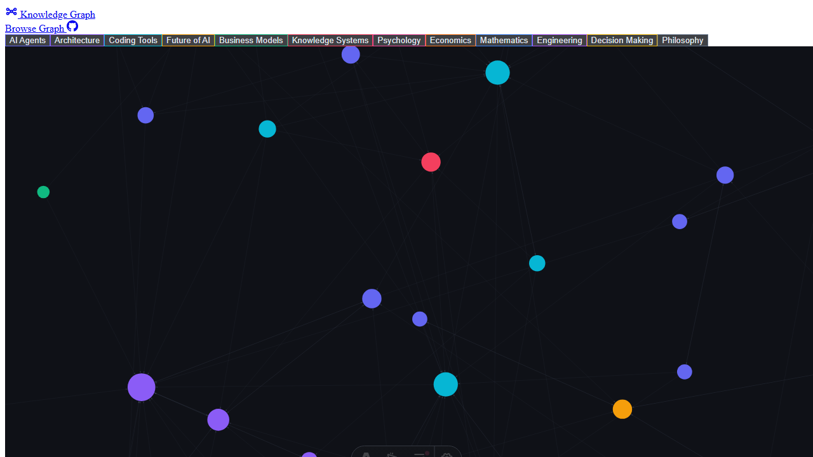
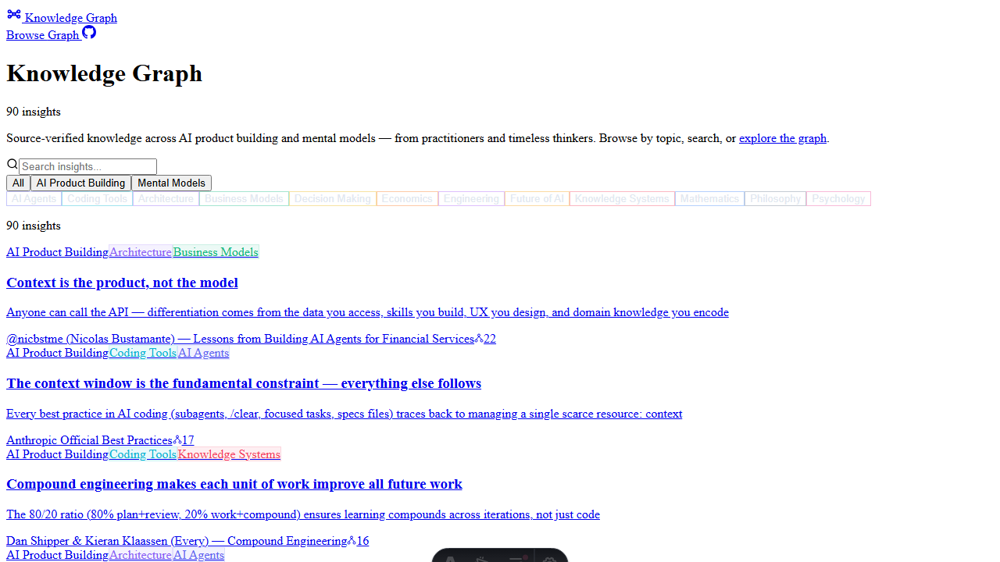

# Knowledge Graph

[](https://ayushjj.github.io/knowledge-graph/) [](https://github.com/ayushjj/knowledge-graph/commits/master)

> Munger says you can't really know anything useful by remembering isolated facts — they must hang on a latticework of theory. I was doing exactly that with AI articles: isolated facts scattered across dozens of chat threads, rediscovered months later with no connection between them.



## Why this exists

I had dozens of Claude conversations, each exploring a different AI article. But I kept rediscovering the same patterns months later in different threads. I couldn't connect the dots across sources.

So I built a knowledge graph. Each article gets broken into 2-5 atomic insights, and those insights get linked to related ones from other sources. The connections are where the real value lives — not any single insight.

It's still an experiment. The agent use case works well. The human browsing UX needs your help.

## What's in it

90+ insights across 2 domains, updated weekly as I encounter new ideas:

**AI Product Building** (6 topics): Agents, Architecture, Coding Tools, Business Models, Knowledge Systems, Future of AI

**Mental Models** (6 topics): Psychology, Economics, Decision Making, Engineering, Philosophy, Mathematics

**Sources**: Charlie Munger's Almanack, Nicolas Bustamante, Dan Shipper, Andrej Karpathy, Anthropic Engineering, and [20+ other practitioners](#sources).

## Two ways to use it

### 1. Browse the web app



- Card feed sorted by most-connected insights, with topic filtering and full-text search
- Interactive force-directed graph visualization — see how insights cluster and connect
- Also works as an Obsidian vault (all `[[wikilinks]]` resolve natively)

**[Explore the live site](https://ayushjj.github.io/knowledge-graph/)**

### 2. Feed it to an AI agent

This is where the real value is today. Point Claude Code (or any AI agent) at `graph-index.yaml` — one YAML file with all 90+ nodes, descriptions, and connections.

```yaml
# Add this one line to your CLAUDE.md:
When making architectural decisions or reviewing plans, read `graph-index.yaml`
and check if any insights are relevant to the current decision.
```

Use cases: architecture brainstorming, plan review, understanding what practitioners are saying about a topic. An agent reading 90 connected insights produces genuinely different thinking than starting from scratch.

## How it grows

This is a living graph, not a snapshot. I add insights every week as I encounter ideas that shift how I think.

- **Source-verified**: Every insight traced to original author + page number
- **`/learn <url>`** extracts insights from any article automatically
- **`/learn-book <pdf>`** processes books chapter by chapter

Star or watch the repo to see new insights as they land.

## Contributing

If you've found value in the graph, add an insight from an article that changed how you think. See [CONTRIBUTING.md](CONTRIBUTING.md) for the simple process: fork, add a file, submit a PR.

All PRs reviewed by maintainer before merging.

## Structure

```
knowledge-graph/
├── index.md              # Entry point — topic map + cross-domain highlights
├── graph-index.yaml      # Machine-readable graph (all nodes + links)
├── topics/               # 12 topic MOCs (Maps of Content)
│   ├── ai-agents.md
│   ├── business-models.md
│   └── ...
└── insights/             # 90+ individual insight files
    ├── context-is-the-product-not-the-model.md
    ├── features-are-prompts-not-code.md
    └── ...
```

## Sources

These ideas belong to the people below — I'm just the curator who connected them.

**Major contributors (2+ insights):**

- **Nicolas Bustamante ([@nicbstme](https://twitter.com/nicbstme))** — AI agents for financial services, agent-native architecture, API-first SaaS
- **Rohit ([@rohit4verse](https://twitter.com/rohit4verse))** — Agent memory, knowledge transfer, tiered retrieval, embeddings
- **Anthropic Engineering** — Tool design, agent evaluation, best practices
- **Boris Cherny** — Claude Code team, agentic search, distributed agent workflows
- **Ashpreet Bedi ([@ashpreetbedi](https://twitter.com/ashpreetbedi))** — Spec-first development, error memory, Agno framework
- **[Dan Shipper](https://twitter.com/danshipper)** — Every, agent-native architectures
- **Alton Syn ([@WorkflowWhisper](https://twitter.com/WorkflowWhisper))** — Implementation gap, technical knowledge as liability

**Single-insight contributors:**

[Andrej Karpathy](https://twitter.com/karpathy) ·
[Clara Shih](https://twitter.com/clarashih) ·
[Chrys Bader](https://twitter.com/chrysb) ·
[Matt Shumer](https://twitter.com/mattshumer_) ·
[Nader Dabit](https://twitter.com/dabit3) ·
[Will Manidis](https://twitter.com/WillManidis) ·
[Steven Sinofsky](https://twitter.com/stevesi) ·
[Natasha Malpani](https://twitter.com/natashamalpani) ·
[Gokul R](https://twitter.com/gokulr) ·
[Jaya Gupta](https://twitter.com/JayaGup10) ·
[Akshay Pachaar](https://twitter.com/akshay_pachaar) ·
[Vasuman](https://twitter.com/vasuman) ·
Benjamin De Kraker ·
Kushal Byatnal ·
[Tobi Lutke](https://twitter.com/tobi) ·
[Ryan Carson](https://twitter.com/ryancarson) ·
[Heinrich](https://twitter.com/arscontexta) ·
[shadcn](https://twitter.com/shadcn) ·
[Zain Hoda](https://twitter.com/zain_hoda) ·
[Thariq](https://twitter.com/trq212) ·
Databricks ·
[Konstantine Buhler](https://twitter.com/Konstantine) ·
[VectifyAI](https://github.com/VectifyAI/PageIndex) ·
OpenAI Codex Team ·
[Aravind Srinivas](https://twitter.com/AravSrinivas)

---

Built by [Ayush](https://github.com/ayushjj) with Claude Code. Still an experiment — feedback welcome.
